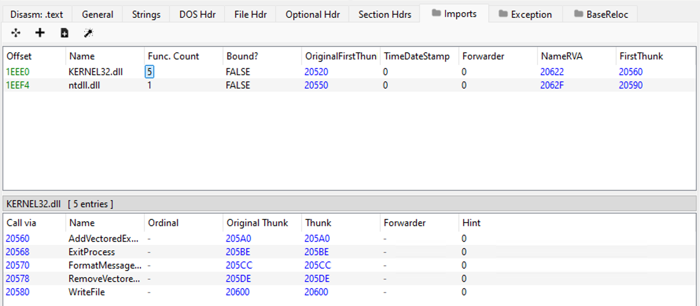

# pebwalker
> a simple proof of concept to learn about reducing IoCs in PE files

## Build
`zig build-exe main.zig -target x86_64-windows -Drelease-small -fsingle-threaded -fstrip -fPIC`

## Details
should compile down to ~150kb exe, prolly can be reduced more but not my primary focus
`.rwxr-xr-x@ 137k ziggoon 22 Mar 11:51  main.exe`

imports should be very limited to those expected of all PEs

